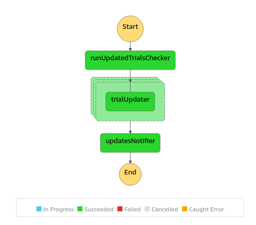

# Clinical Trials Monitor

This is a personal project to receive alerts when clinical trials are updated on clinicaltrials.gov.

Keeping track of multiple trials, and determining what exactly has changed is a time consuming process. Luckily, ClinicalTrials.gov provides an API, so I've built a "clinicaltrials monitor" to receive automatic updates of the trials that I'm interested in.

The service uses the following technology:

- [Serverless Framework](https://serverless.com), with:
  - [AWS CloudFormation](https://aws.amazon.com/cloudformation/)
  - [serverless-offline](https://github.com/dherault/serverless-offline)
  - [serverless-step-functions](https://github.com/serverless-operations/serverless-step-functions)
  - [serverless-step-functions-offline](https://github.com/vkkis93/serverless-step-functions-offline)
- [AWS Step Functions](https://aws.amazon.com/step-functions/), with:
  - [AWS Lambda](https://aws.amazon.com/lambda/) ([Node.js](https://nodejs.org/en/))
- [MongoDB Atlas](https://www.mongodb.com/cloud/atlas)
  - [Mongo Seeding](https://github.com/pkosiec/mongo-seeding)
- [AWS Simple Email Service](https://aws.amazon.com/ses/)
- clinicaltrials.gov API

The Step Functions workflow is executed several times per day, see how it works below:

## Step Functions workflow

- A MongoDB collection holds a list of clinical trials to monitor
- A Step Functions workflow is periodically executed to check for updated trials
- For each updated trial, a Lambda function is triggered, to:
  - Fetch the full trial record and update it in MongoDB
  - Determine the diff between the previous and latest version of the trial
- Once all trial records have been updated, another Lambda function is triggered, to:
  - Format a summary of all detected changes
  - Send the summary as an email
